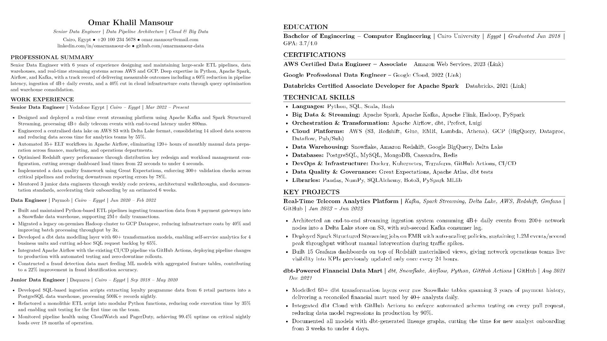

# claude-ats-cv-skill

A Claude AI skill that builds **ATS-optimised, human-sounding CVs in LaTeX** — ready to compile on Overleaf in minutes.

Built for job seekers who want a CV that passes Applicant Tracking Systems **and** reads like a real human wrote it. No AI filler. No invented metrics. No templates that look like every other CV.

> This skill helped its author land a Data Scientist role in Dubai. It encodes exactly what worked.

---

## Example Output



---

## What It Does

- **Detects your mode automatically** — upload an existing CV to reconstruct it, or start from scratch
- **Gathers your info conversationally** — asks only what it needs, nothing more
- **Searches real job postings** (Indeed, LinkedIn, Glassdoor) if you don't have a JD to tailor against
- **Enforces ATS best practices** — no tables, no colours, no icons, no photos
- **Blocks AI filler words** — "passionate", "leveraged", "spearheaded" and 30+ more are hard-blocked
- **Flags vague bullets** — suggests ways to quantify without inventing numbers
- **Outputs raw LaTeX only** — paste straight into Overleaf, hit Recompile, done
- **Guides you through Overleaf** — step-by-step export instructions included every time

---

## Quick Install

### Option 1 — Claude.ai (Web)
1. Download this repo as a ZIP (`Code → Download ZIP`)
2. Go to **claude.ai → Settings → Customize → Skills**
3. Upload the ZIP — make sure the folder is at the root of the ZIP, not just the contents
4. Done. Claude will trigger the skill automatically on any CV request

### Option 2 — Claude Code (Terminal)
```bash
# Personal (available in all your sessions)
git clone https://github.com/NoahMustafa/claude-ats-cv-skill.git ~/.claude/skills/ats-latex-cv

# Project-level (shared with teammates who clone your repo)
git clone https://github.com/NoahMustafa/claude-ats-cv-skill.git .claude/skills/ats-latex-cv
```

### Option 3 — npx (via skills.sh)
```bash
npx skills add https://github.com/NoahMustafa/claude-ats-cv-skill
```

---

## How to Use It

Just talk to Claude naturally. The skill triggers automatically. Examples:

```
"Build me a CV for a Data Analyst role in Dubai"
"Rewrite my CV for a Machine Learning Engineer position"
"I'm applying for a Product Manager role — help me make my CV"
"Here's my current CV [upload image/PDF] — reconstruct it and tailor it for this JD"
```

Claude will:
1. Detect whether you're starting fresh or reconstructing an existing CV
2. Ask for any missing information conversationally
3. Research relevant job postings if you don't provide a JD
4. Write your CV following all rules below
5. Output clean LaTeX code + Overleaf compilation guide

---

## Rules the Skill Enforces

| Rule | Behaviour |
|------|-----------|
| AI filler words (`passionate`, `leveraged`, `spearheaded`…) | Hard block — warns you and rewrites |
| AI writing patterns (em-dashes mid-phrase, emojis, bullets starting with "I") | Hard block — warns you and rewrites |
| Vague bullets with no metric or outcome | Flags it — suggests quantification options, never invents numbers |
| Page length | Recommends based on experience level, you can override |
| Certifications / Languages | Only asked if relevant to the target role |
| Colours, photos, icons, tables | Warns strongly — you can override |
| Date format | `Mon YYYY` only (e.g. `Apr 2026`) |
| Output | Raw LaTeX only — no markdown fences, no commentary |

---

## The Bullet Formula

Every work experience and project bullet follows this guideline:

> **[Strong past-tense verb]** + **[what you built/did]** + **[scale or scope]** + **[measurable result]**

**Example:**
> Reduced query execution time to under 200ms by designing SQL pipelines, enabling live KPI tracking across 15K+ user dashboards.

Natural variation is allowed — bullets should not all sound identical. But every bullet must have at least one of: a metric, a scale indicator, or a concrete outcome.

---

## Overleaf (Free Compiler)

The skill outputs LaTeX code. To turn it into a PDF:

1. Go to [overleaf.com](https://www.overleaf.com) → Sign Up → Continue with Google
2. Create a New Project → Blank Project
3. Replace all code in the editor with the LaTeX output from Claude
4. Hit the green **Recompile** button
5. Click the **download icon** next to Recompile to export as PDF

---

## Version History

| Version | Date | Notes |
|---------|------|-------|
| v1.0.0 | 2026-04-28 | Initial release |

---

## Contributing

Found a filler word that slipped through? Got a stronger LaTeX pattern? PRs are welcome.

1. Fork the repo
2. Make your changes to `SKILL.md` or the relevant reference file
3. Open a PR with a clear description of what you changed and why

---

## License

MIT — free to use, modify, and distribute.

---

*Built with and Maintained by [@NoahMustafa](https://github.com/NoahMustafa)*
